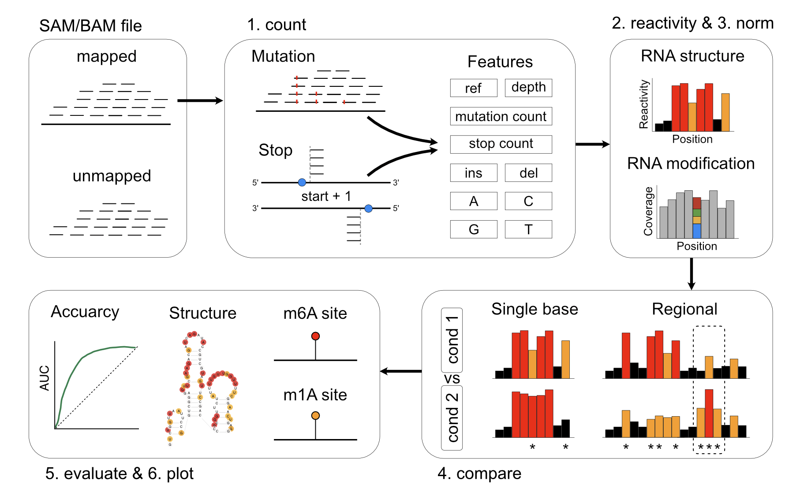
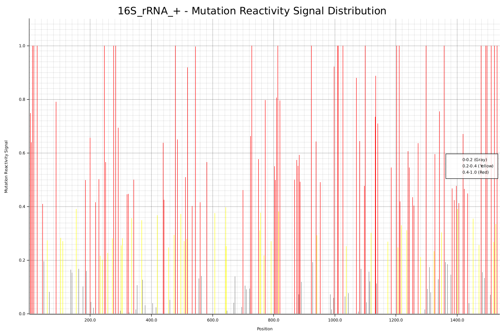

# ModTector

ModTector is a high-performance RNA modification detection tool developed in Rust, supporting multi-signal analysis, data normalization, reactivity calculation, and accuracy assessment. Based on pileup analysis, it can detect RNA modification sites from BAM-format sequencing data and generate rich visualization results.

## 🚀 Key Features

- **Multi-signal Analysis**: Simultaneous analysis of stop signals (pipeline truncation) and mutation signals (base mutations)
- **High-performance Pileup**: Robust pileup traversal based on htslib, supporting large file processing
- **Batch Processing**: Process multiple BAM files sequentially with glob pattern matching
- **Single-cell Unified Processing**: Unified processing strategy for single-cell data with cell label extraction and splitting
- **Data Distribution Optimization**: Smart data distribution scanning for efficient processing
- **Data Normalization**: Signal validity filtering and outlier handling
- **Reactivity Calculation**: Calculate signal differences between modified and unmodified samples with multi-threading support
- **Duet Ensemble Decomposition**: Sliding-window inference of dynamic RNA ensembles with global aggregation across overlaps using read-level stop/mutation co-variation
- **Accuracy Assessment**: AUC, F1-score and other metrics evaluation based on secondary structure with auto-shift correction
- **Rich Visualization**: Signal distribution plots, reactivity plots, ROC/PR curves, and RNA structure SVG plots
- **Multi-threading**: Parallel processing and plotting for improved efficiency
- **Complete Workflow**: One-stop solution from raw data to final evaluation
- **Base Matching**: Intelligent base matching algorithm handling T/U equivalence
- **Auto-alignment**: Auto-shift correction for sequence length differences

## 🔄 Complete Workflow

The following diagram shows the complete ModTector workflow from raw data to evaluation results:



ModTector provides a complete workflow from raw BAM data to final evaluation results:

1. **Data Input**: BAM files (modified/unmodified samples), FASTA reference sequences, secondary structure files
2. **Statistical Analysis**: Pileup traversal, counting stop and mutation signals
3. **Reactivity Calculation**: Calculate signal differences between modified and unmodified samples, generate reactivity data
4. **Data Normalization**: Normalize reactivity signals, signal filtering, outlier handling, background correction
5. **Duet Ensemble Decomposition**: Infer alternative RNA conformations from normalized reactivity with read-level evidence
6. **Comparative Analysis**: Compare modified vs unmodified samples, identify differential modification sites
7. **Visualization**: Generate signal distribution plots, reactivity plots, and RNA structure SVG plots
8. **Accuracy Assessment**: Performance evaluation based on secondary structure

## 🔧 Installation

### System Requirements

- **Operating System**: Linux, macOS, or Windows
- **Memory**: 4 GB RAM (8 GB recommended for large datasets)
- **Storage**: 2 GB free space
- **CPU**: Multi-core processor recommended for parallel processing

### Required Dependencies

- **Rust**: Version 1.70 or higher
- **Cargo**: Included with Rust installation

### Installing Rust

#### Linux/macOS
```bash
curl --proto '=https' --tlsv1.2 -sSf https://sh.rustup.rs | sh
source ~/.cargo/env
```

#### Windows
Download and run the rustup installer from https://rustup.rs/

### Installing ModTector

#### From crates.io (Recommended)
```bash
cargo install modtector
```

#### From Source
```bash
git clone https://github.com/TongZhou2017/ModTector.git
cd ModTector
cargo build --release
```

### System Dependencies

ModTector requires the following system libraries:

#### Linux (Ubuntu/Debian)
```bash
sudo apt-get update
sudo apt-get install build-essential pkg-config libssl-dev libhts-dev
```

#### Linux (CentOS/RHEL)
```bash
sudo yum groupinstall "Development Tools"
sudo yum install pkgconfig openssl-devel htslib-devel
```

#### macOS
```bash
xcode-select --install
brew install htslib
```

### Rust Dependencies

ModTector uses the following Rust crates:

```toml
[dependencies]
rust-htslib = "0.47.0"    # BAM file processing
bio = "2.0.1"             # Bioinformatics utilities
plotters = { version = "0.3", features = ["svg_backend", "bitmap_backend"] }  # Plotting and visualization
csv = "1.3"               # CSV file handling
rayon = "1.8"             # Parallel processing
clap = { version = "4.5", features = ["derive"] }  # Command-line argument parsing
chrono = "0.4"            # Date and time handling
rand = "0.8"              # Random number generation
quick-xml = "0.36"        # XML/SVG parsing
regex = "1.11"            # Regular expressions
```

## 📋 Command Line Usage

### Quick Start

```bash
# Generate pileup data from BAM files
modtector count -b sample.bam -f reference.fa -o output.csv

# Calculate reactivity scores
modtector reactivity -M mod_sample.csv -U unmod_sample.csv -O reactivity.csv
# (Optional) For workflows without an unmodified control, omit -U to run in mod-only mode
# modtector reactivity -M smartshape_mod.csv -O reactivity.csv

# Normalize reactivity signals
modtector norm -i reactivity.csv -o normalized_reactivity.csv -m winsor90

# Compare samples and identify differences
modtector compare -m mod_sample.csv -u unmod_sample.csv -o comparison.csv

# Generate visualizations
modtector plot -M mod_sample.csv -U unmod_sample.csv -o plots/ -r normalized_reactivity.csv

# Generate RNA structure SVG plots
modtector plot -o svg_output/ --svg-template rna_structure.svg --reactivity normalized_reactivity.csv

# Evaluate accuracy
modtector evaluate -r normalized_reactivity.csv -s structure.dp -o results/ -g gene_id

# Duet ensemble decomposition (Stop + Mutation co-variation, 100-nt windows)
modtector duet \
  -i normalized_reactivity.csv \
  -b sample.sort.bam \
  -f reference.fa \
  -o duet_windows.csv \
  --epsilon 0.8 \
  --min-samples 8 \
  --window-size 100 \
  --window-step 50 \
  -t 16
```

### 1. Count - Data Processing

Generate pileup data from BAM files by counting stop and mutation signals.

```bash
modtector count [OPTIONS] --bam <BAM> --fasta <FASTA> --output <OUTPUT>
```

**Parameters:**
- `-b, --bam`: Input BAM file path (must be sorted and indexed), or glob pattern for batch/single-cell mode
- `-f, --fasta`: Reference FASTA file path
- `-o, --output`: Output CSV file path (or directory for batch/single-cell mode)
- `-s, --strand`: Optional strand filter (`+`, `-`, or `+/-`; default `+/-`)
- `-t, --threads`: Number of parallel threads (default: 1)
- `-w, --window`: Window size for genome segmentation in bases (optional)
- `-l, --log`: Log file path (optional)
- `--batch`: Enable batch mode for sequential file processing (use glob pattern)
- `--single-cell`: Enable single-cell unified processing mode (use glob pattern, unified processing with cell labels)

**Input File Requirements:**
- **BAM files**: Must be sorted and indexed. Use samtools for sorting and indexing:
  ```bash
  samtools sort input.bam -o sorted.bam
  samtools index sorted.bam
  ```
- **FASTA files**: Reference genome sequence file, sequence IDs must match chromosome names in BAM file

**Example:**
```bash
# Standard mode: process single BAM file
modtector count \
  -b data/mod_sample.bam \
  -f data/reference.fa \
  -o result/mod.csv \
  -t 8

# Batch mode: process multiple BAM files sequentially
modtector count --batch \
  -b "/path/to/bam/*sort.bam" \
  -f data/reference.fa \
  -o result/batch_output/ \
  -t 8 \
  -w 10000

# Single-cell unified mode: unified processing with cell labels
modtector count --single-cell \
  -b "/path/to/single_cell/*sort.bam" \
  -f data/reference.fa \
  -o result/single_cell_output/ \
  -t 8 \
  -w 10000
```

**Batch and Single-cell Modes:**
- **Batch mode** (`--batch`): Processes multiple BAM files sequentially, each file independently. Suitable for scenarios where files need separate processing.
- **Single-cell unified mode** (`--single-cell`): True unified processing strategy that:
  - Reads all BAM files at once for each window
  - Collects all reads from all files, unified pileup processing
  - Tracks cell labels during processing, splits results by cell
  - Provides 2-3x performance improvement by:
    - Skipping data distribution scanning (direct processing of all reference sequences)
    - Unified read collection and pileup (reduces I/O overhead)
    - Better parallelization efficiency (cross-file parallel processing)
    - Window-based memory management (prevents memory accumulation)
  
**Cell Label Extraction:**
- Automatically extracts cell labels from BAM filenames
- Supports RHX pattern (e.g., `*RHX672.sort.bam` → `RHX672`)
- Falls back to last underscore-separated part if RHX not found
- Example: `in_vivo_single_cell_Mut_transfected_RNAs_in_HEK293T_DMSO_RHX672.sort.bam` → `RHX672`

**Progress Reporting:**
- Real-time progress display: chunks processed, percentage, processing speed
- Estimated time remaining (ETA) based on current processing speed
- CPU usage recommendations based on BAM file count
- Automatic suggestions for optimal thread count

**Output Format (CSV):**
```
ChrID,Strand,Position,RefBase,StopCount,MutationCount,Depth,InsertionCount,DeletionCount,BaseA,BaseC,BaseG,BaseT
```

### 2. Norm - Data Normalization

Normalize and filter signals to remove noise and outliers.

```bash
modtector norm [OPTIONS] --input <INPUT> --output <OUTPUT>
```

**Parameters:**
- `-i, --input`: Input CSV file
- `-o, --output`: Output normalized CSV file
- `-m, --method`: Normalization method (winsor90, percentile28, boxplot)
- `--bases`: Target bases for analysis (e.g., AC for A and C bases)
- `--coverage-threshold`: Coverage threshold (default: 0.2)
- `--depth-threshold`: Depth threshold (default: 50)

**Example:**
```bash
modtector norm \
  -i result/mod.csv \
  -o result/mod_norm.csv \
  -m winsor90 \
  --bases AC \
  --coverage-threshold 0.2 \
  --depth-threshold 50
```

### 3. Reactivity - Reactivity Calculation

Calculate reactivity scores by comparing modified and unmodified samples.

```bash
modtector reactivity [OPTIONS] --mod-csv <MOD_CSV> --unmod-csv <UNMOD_CSV> --output <OUTPUT>
```

**Parameters:**
- `-M, --mod-csv`: Modified sample CSV
- `-U, --unmod-csv`: Unmodified sample CSV
- `-O, --output`: Output reactivity file
- `-s, --stop-method`: Stop signal method (current, ding, rouskin)
- `-m, --mutation-method`: Mutation signal method (current, siegfried, zubradt)
- `-t, --threads`: Number of parallel threads (default: 8)
- `--pseudocount`: Pseudocount parameter for Ding method (default: 1.0)
- `--maxscore`: Maximum score limit for Ding method (default: 10.0)

**Stop Signal Methods:**
- **current**: k-factor correction method (default)
- **ding**: Ding et al., 2014 logarithmic processing method
- **rouskin**: Uses only modified sample stop signal

**Mutation Signal Methods:**
- **current**: k-factor correction method (default)
- **siegfried**: Siegfried method for mutation signal processing
- **zubradt**: Uses only modified sample mutation signal

**Example:**
```bash
# Using default method
modtector reactivity \
  -M result/mod.csv \
  -U result/unmod.csv \
  -O result/reactivity.csv \
  -t 24

# Using Ding method for stop signal
modtector reactivity \
  -M result/mod.csv \
  -U result/unmod.csv \
  -O result/reactivity.csv \
  -t 24 \
  -s ding \
  --pseudocount 1.0 \
  --maxscore 10.0
```

**Output Format (CSV):**
```
ChrID,Strand,Position,RefBase,Reactivity
```

### 4. Compare - Sample Comparison

Compare modified and unmodified samples to identify differential modification sites.

```bash
modtector compare [OPTIONS] --mod-csv <MOD_CSV> --unmod-csv <UNMOD_CSV> --output <OUTPUT>
```

**Parameters:**
- `-m, --mod-csv`: Modified sample CSV
- `-u, --unmod-csv`: Unmodified sample CSV
- `-o, --output`: Output comparison CSV file
- `--min-depth`: Minimum depth threshold (default: 10)
- `--min-fold`: Minimum fold change threshold (default: 2.0)

**Example:**
```bash
modtector compare \
  -m result/mod.csv \
  -u result/unmod.csv \
  -o result/comparison.csv \
  --min-depth 10 \
  --min-fold 2.0
```

**Output Format (CSV):**
```
ChrID,Strand,Position,RefBase,ModStop,ModMutation,ModDepth,UnmodStop,UnmodMutation,UnmodDepth,StopFoldChange,MutationFoldChange,ModificationScore
```

### 5. Plot - Visualization

Generate visualization plots including signal distributions and RNA structure SVG plots.

```bash
modtector plot [OPTIONS] --mod-csv <MOD_CSV> --unmod-csv <UNMOD_CSV> --output <OUTPUT>
```

**Parameters:**
- `-M, --mod-csv`: Modified sample CSV (optional for SVG-only mode)
- `-U, --unmod-csv`: Unmodified sample CSV (optional for SVG-only mode)
- `-o, --output`: Output directory
- `-r, --reactivity`: Reactivity file (optional)
- `-t, --threads`: Number of parallel threads (default: 8)
- `--coverage-threshold`: Coverage threshold (default: 0.2)
- `--depth-threshold`: Depth threshold (default: 50)

**SVG Plotting Options:**
- `--svg-template`: SVG template file path
- `--svg-bases`: Bases to plot (default: ATGC)
- `--svg-signal`: Signal type to plot (stop, mutation, all)
- `--svg-strand`: Strand to include (+, -, both)
- `--svg-ref`: Reference sequence file for alignment
- `--svg-max-shift`: Maximum shift for alignment (default: 50)

**Example:**
```bash
# Regular plotting
modtector plot \
  -M result/mod.csv \
  -U result/unmod.csv \
  -o result/plots \
  -r result/reactivity.csv \
  -t 8

# SVG-only mode
modtector plot \
  -o svg_output/ \
  --svg-template rna_structure.svg \
  --reactivity result/reactivity.csv \
  --svg-signal all \
  --svg-strand +

# Combined mode (regular + SVG)
modtector plot \
  -M result/mod.csv \
  -U result/unmod.csv \
  -o result/plots \
  --svg-template rna_structure.svg \
  --reactivity result/reactivity.csv
```

### 6. Evaluate - Accuracy Assessment

Evaluate the accuracy of results using known secondary structure.

```bash
modtector evaluate [OPTIONS] --reactivity-file <REACTIVITY_FILE> --structure-file <STRUCTURE_FILE> --output-dir <OUTPUT_DIR>
```

**Parameters:**
- `-r, --reactivity-file`: Reactivity CSV file (stop or mutation type)
- `-s, --structure-file`: Secondary structure file (.dp format)
- `-o, --output-dir`: Output directory
- `-g, --gene-id`: Gene ID (optional, for base matching)
- `-S, --strand`: Strand information (optional, default: +)
- `--signal-type`: Signal type (stop or mutation)

**Example:**
```bash
# Evaluate stop signal accuracy
modtector evaluate \
  --reactivity-file result/reactivity_stop.csv \
  --structure-file data/structure.dp \
  --output-dir result/eval \
  --signal-type stop \
  --gene-id gene_id

# Evaluate mutation signal accuracy
modtector evaluate \
  --reactivity-file result/reactivity_mutation.csv \
  --structure-file data/structure.dp \
  --output-dir result/eval \
  --signal-type mutation \
  --gene-id gene_id
```

**Evaluation Metrics:**
- **AUC**: ROC curve area under curve (0.5-1.0, higher is better)
- **F1-score**: Harmonic mean of precision and recall (0-1, higher is better)
- **Sensitivity**: True positive rate (0-1, higher is better)
- **Specificity**: True negative rate (0-1, higher is better)
- **Precision**: Positive predictive value (0-1, higher is better)
- **Recall**: True positive rate (0-1, higher is better)
- **Accuracy**: Proportion of correct classifications (0-1, higher is better)

### 7. Duet - Dynamic Ensemble Decomposition

Duet performs a sliding-window analysis (default 100-nt windows with 50-nt step) that jointly examines normalized stop/mutation reactivities and read-level co-variation to determine whether multiple conformations coexist within each genomic segment. Clustering is carried out per window via DBSCAN on read-level stop/mutation co-occurrence features, eliminating the need to predefine the number of ensembles.

```bash
modtector duet [OPTIONS] --input <INPUT> --bam <BAM> --fasta <FASTA> --output <OUTPUT>
```

**Key Parameters:**
- `-i, --input`: Normalized reactivity CSV file (output from `modtector norm`)
- `-b, --bam`: Sorted BAM alignment for the same sample
- `-f, --fasta`: Reference FASTA used for alignment
- `-o, --output`: Window-level CSV summarising ensemble detection
- `--epsilon`: DBSCAN radius in standardized feature space (default: 0.75)
- `--min-samples`: Minimum neighbours for a DBSCAN core read (default: 5)
- `--window-size`: Sliding-window size in nucleotides (default: 100)
- `--window-step`: Sliding-window step in nucleotides (default: 50)
- `-t, --threads`: Number of threads for parallel processing (default: system CPU count)
- `--summary-output`: Optional per-window/per-ensemble CSV path (default `<output>_summary.csv`)
- `-l, --log`: Log file path (optional)

**Example:**
```bash
# Infer window-level ensembles (100-nt windows, 50-nt step, 16 threads)
modtector duet \
  -i signal/03_norm/iso-1_rep-1_norm.csv \
  -b signal/00_bam/iso-1_rep-1.sort.bam \
  -f reference/PDL1.fa \
  -o signal/04_duet/iso-1_rep-1_windows.csv \
  --epsilon 0.85 \
  --min-samples 8 \
  --window-size 100 \
  --window-step 50 \
  -t 16
```

**Progress Reporting:**
During execution, duet provides detailed statistics:
- Number and percentage of reads with dual signals (both stop and mutation)
- Number and percentage of positions assigned high confidence (reactivity >= 0.7)
- Average position confidence and total positions analyzed

**Window CSV Columns:**
- `ChrID,Strand,WindowStart,WindowEnd`: Genomic window coordinates
- `Status`: `OK`, `InsufficientReads`, or `LowDensity`
- `ReadCount`: Number of reads contributing stop/mutation signals inside the window
- `EnsembleCount`: Number of DBSCAN ensembles (noise excluded)
- `PrimaryEnsembleID / PrimaryOccupancy`: Highest-occupancy ensemble (if any)
- `NoiseFraction`: Fraction of reads classified as DBSCAN noise
- `DualSignalFraction`: Fraction of reads in the window carrying both stop and mutation evidence
- `MeanStopReactivity / MeanMutationReactivity`: Average normalized reactivity values across positions in the window
- `ClusterSummary`: Concise per-ensemble occupancy/ confidence/ signal statistics
- `GlobalEnsembles`: Mapping from window-local cluster IDs to global ensemble IDs (e.g., `c1->E1|E2`)

**Summary CSV Columns:**
- Window coordinates and status (mirroring the main CSV)
- `EnsembleID / GlobalEnsembleID / IsNoise / Members / Occupancy`
- `ClusterConfidence`: Confidence score for the window-level cluster (0-1)
- `MeanStopCount / MeanMutationCount / DualSignalFraction`
- Window-level mean reactivities for convenience

**Global Ensemble CSV (`<output>_global.csv`) Columns:**
- `ChrID,Strand,GlobalEnsembleID`: Transcript and ensemble identifier
- `WindowCount / ClusterCount`: Number of contributing windows and window-clusters
- `ReadCount`: Total reads assigned to the global ensemble
- `TotalStopReads / TotalMutationReads`: Aggregated stop/mutation read counts
- `DualSignalReads`: Reads exhibiting both stop and mutation signals inside the ensemble
- `UniquePositions`: Number of distinct positions linked to the ensemble
- `Confidence`: Global ensemble confidence score derived from supporting clusters

**Global Per-base CSV (`<output>_global_per_base.csv`) Columns:**
- `ChrID,Strand,Position,GlobalEnsembleID`: Genomic coordinate annotated with global ensemble ID
- `StopReads / MutationReads`: Read support contributed by the ensemble at the position
- `StopReactivity / MutationReactivity`: Normalized reactivity values inherited from the window input
- `PositionConfidence`: Confidence score for the ensemble assignment at this base

## 📊 Representative Visualization Results

The following shows typical visualization results generated by ModTector:

**Overall Signal Distribution Scatter Plot**: Shows signal comparison between modified and unmodified groups at all positions


**ROC Curve Evaluation Results**: Accuracy assessment based on 16S rRNA secondary structure

| Stop Signal ROC Curve | Mutation Signal ROC Curve |
|----------------------|---------------------------|
|  |  |

**Signal Distribution Plots**: Display stop and mutation signal distribution across gene positions

| Stop Signal Distribution | Mutation Signal Distribution |
|--------------------------|------------------------------|
|  |  |

**Reactivity Plots**: Bar charts showing reactivity intensity of modification sites

| Stop Signal Reactivity | Mutation Signal Reactivity |
|------------------------|----------------------------|
|  |  |


## 🧪 Example Dataset

To help you get started quickly, we provide a minimal example dataset that can be used to test ModTector functionality. This dataset is available at [Zenodo (10.5281/zenodo.17316476)](https://doi.org/10.5281/zenodo.17316476).

### Download and Setup

1. Download the example dataset from Zenodo:
   ```bash
   wget https://zenodo.org/record/17316476/files/modtector_example_dataset.zip
   unzip modtector_example_dataset.zip
   cd modtector_example_dataset
   ```

2. Run the example script:
   ```bash
   bash test_modtector_v0.10.0.sh
   ```

This script will run a complete ModTector workflow on a small example dataset, demonstrating all major functionality including pileup processing, reactivity calculation, normalization, Duet sliding-window ensemble analysis, visualization, and evaluation.

### Expected Results

After running the example script, you will see output files in the `signal_v0.5.6/` directory, organized by processing step:
- `01_count/` - Pileup count results
- `02_reactivity/` - Reactivity calculation results
- `03_norm/` - Normalized reactivity data
- `04_duet/` - Duet sliding-window ensemble analysis results (window/summary CSVs plus `<name>_global.csv` and `<name>_global_per_base.csv`)
- `05_plot/` - Visualization plots
- `06_evaluate/` - Accuracy evaluation results
- `logs/` - Processing logs

## 📈 Performance Optimization

- **Multi-threading Support**: Reactivity and plot commands support multi-threaded parallel processing
- **Memory Optimization**: Pileup analysis uses stream processing to reduce memory consumption
- **Boundary Checking**: Enhanced data validity validation for improved stability
- **Progress Reporting**: Detailed processing progress, timing reports, and statistical summaries (dual-signal reads, high-confidence positions)

## ⚠️ Important Notes

- Ensure BAM files are properly sorted and indexed
- Sequence IDs in FASTA files must match chromosome names in BAM files
- Use multi-threading parameters when processing large files
- Evaluation function only analyzes genes with secondary structure information
- Recommend using sufficient memory for processing large datasets

## 🔬 Technical Features

- **Based on stone project**: Added complete workflow on top of the stone project
- **Rust High Performance**: Leverages Rust's memory safety and concurrency features
- **htslib Integration**: Uses mature htslib library for BAM file processing
- **Modular Design**: Independent functional modules for easy maintenance and extension

## 📄 License

This project is licensed under the MIT License.

## 🤝 Contributing

Issues and Pull Requests are welcome to improve ModTector.

## 📚 Documentation

- [Installation Guide](docs/installation.md) - Detailed installation instructions
- [Quick Start Guide](docs/quickstart.md) - Get started in minutes
- [User Guide](docs/user-guide.md) - Comprehensive usage guide
- [Command Reference](docs/commands.md) - Complete command documentation
- [Examples](docs/examples.md) - Practical examples and tutorials
- [Troubleshooting](docs/troubleshooting.md) - Common issues and solutions

## 📞 Contact

For questions or suggestions, please contact us through GitHub Issues.

## Version Information

- **Current Version**: v0.14.0
- **Release Date**: 2025-01-XX
- **License**: MIT

### v0.14.0 New Features

- **Base Quality Filtering**: Added per-base quality filtering for mutation detection in `modtector count` command
  - New `--min-base-qual` parameter (default: 0, recommended: 20)
  - Filters mutations by base quality score to improve signal-to-noise ratio
  - Filters ~15% of low-quality mutations with min-base-qual=20
  - Minimal performance overhead (<1%)
  - Integrated into Snakefile workflow

### v0.12.1 Bug Fixes

- **Critical Fix**: Fixed NaN value handling in evaluate command
  - Fixed panic when processing reactivity files containing NaN values
  - Properly handles NaN values in sorting and statistical calculations
  - Fixes evaluate_bamreadcount rule failure in Snakefile workflow

### v0.12.0 New Features

- **Bamreadcount Convert Command**: Native Rust implementation for converting bamreadcount format to modtector pileup CSV format
  - New `convert` command: `modtector convert -i input.txt -o output.csv -s +`
  - Replaces Python script with high-performance Rust module
  - Streaming processing supports large files (tested up to 35GB)
  - Integrated into modtector toolchain for consistency
- **Bamreadcount Reactivity Support**: Added workflow support for reactivity calculation using bamreadcount-derived pileup files
  - New `reactivity_bamreadcount` rule in Snakefile
  - Maintains compatibility with existing modtector pileup workflow

### v0.11.1 Bug Fixes

- **Critical Fix**: Corrected stop signal position correction for reverse-strand reads
  - Forward strand: `start_position - 1` (upstream correction)
  - Reverse strand: `start_position + 1` (downstream correction)
  - Ensures accurate genomic position assignment according to theoretical principles
- **Documentation**: Updated signal correction documentation to reflect strand-specific correction formulas

### v0.11.0 New Features

- **Batch Processing Mode**: Process multiple BAM files sequentially with glob pattern matching
- **Single-cell Unified Processing**: Unified processing strategy for single-cell data with automatic cell label extraction
- **Performance Optimization**: 2-3x speedup for single-cell data processing
- **Data Distribution Scanning**: Optimized unified scanning reduces processing time significantly

## Citation

If you use ModTector in your research, please cite:

```bibtex
[Add citation information when available]
```